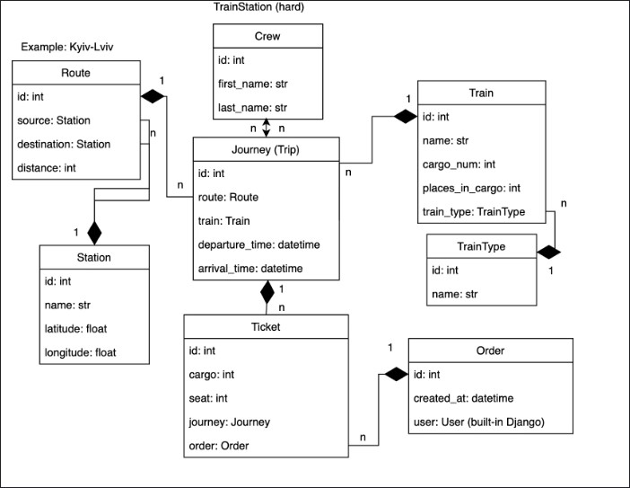

# Railway Station API

API service for railway management written on DRF and Dockerized

# Installing using GitHub

Install PostgresSQL and create db

```shell
git clone https://github.com/saywin/railway-station-api.git
cd railway-station-api
python -m venv venv
venv\bin\activate
pip install -r requirements.txt
set DB_HOST=<your db hostname>
set DB_NAME=<your db name>
set DB_USER=<your db username>
set DB_PASSWORD=<your db user password>
set SECRET_KEY=<your secret key>
python manage.py makemigrations
python manage.py migrate
python manage.py runserver
python manage.py createsuperuser
```

# Run with docker

Docker should be installed (you can download it here: https://www.docker.com/)

```shell
docker-compose build
docker-compose up
docker compose ps
docker exec -it your_image_name sh
- Create new admin user. `docker-compose web app sh -c "python manage.py createsuperuser"`;
- Run tests using different approach: `docker-compose run web sh -c "python manage.py test"`;
```

# Getting access

To access the API endpoints, follow these steps:

1. Go to one of the following URLs:
   - [Login to obtain Token](http://127.0.0.1:8000/api/v1/user/create-user/) 
   - [Obtain Bearer token](http://127.0.0.1:8000/api/v1/user/token/)

2. Type in your Email & Password. For example:
   - Email address: admin@admin.com
   - Password: 1qazcde3

3. After submitting your credentials, you will receive a token. This token grants access to the API endpoints.

# Available Endpoints For Users App

You can use the following endpoints:

- [Refresh Token](http://127.0.0.1:8000/api/v1/user/token/refresh/) - This URL will refresh your token when it expires.
- [Verify Token](http://127.0.0.1:8000/api/v1/user/token/verify/) - This URL will verify if your token is valid and has not expired.
- [User Details](http://127.0.0.1:8000/api/v1/user/me/) - This URL will display information about yourself using the token assigned to your user.

Please note that accessing certain endpoints may require the ModHeader extension, which is available for installation in Chrome.

That's it for user endpoints. You can now proceed to the next step.

# Getting Started With Api

1. First, go to the URL provided: [API Endpoints](http://127.0.0.1:8000/api/v1/railway/). This URL provides all endpoints of the API.

2. Now you are ready to use the API to manage your airport. Have fun!

# Features

- [x] JWT authenticated
- [x] Admin panel available at `/admin/`
- [x] Documentation located at `/api/v1/doc/`
- [x] Managed orders and tickets for the railway
- [x] Created TrainType, Train(with images), Crew, Station (with images), Route, Journey, Orders, Tickets
- [x] Implemented filtering for every endpoint in Swagger
- [x] Filtering Routes by: Destination(?destination=), Source(?source=)
- [x] Filtering Journey by: Departure_time(?date=), Destination(?to=), Source(?from=)
- [x] Created custom field tickets_available for Journey List
- [x] Created test all Models, Serializers, Routers and Views for station app

# DB Structure
